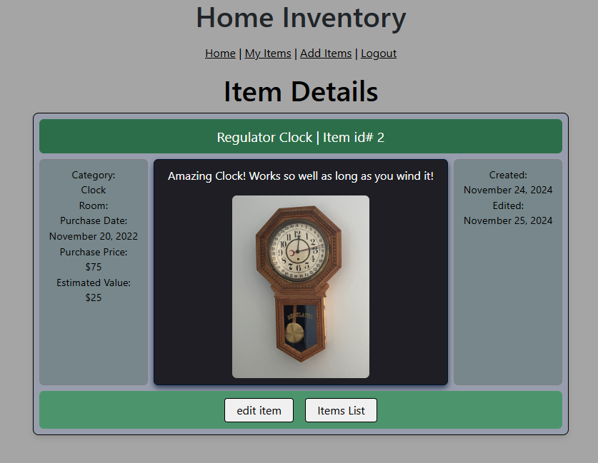

# Home Inventory Application

This application will allow a user to create and account, and catolog items in their home for purpose of organization, insurance, and decluter organization.

# Backend

Java, Spring Boot, PostgreSQL

# Frontend

Vue.js, HTML5, CSS, Bootstrap

## Sample Screenshot

## Key Features

1. [Overview](#overview)

## Table of Contents
1. [Overview](#overview)
2. [Features](#features)
3. [Database Schema](db-schema.png)

---

## Overview
This application allows users to catalog inventory in their homes. The project allows photo uploads using JavaScript 
formData() and creating a multipartFile to be processed on the backend using Java and saving the photo file to a
local folder.

## Features
- Current:
    - User authentication with secure passwords.
    - Item organization by category, create and update dates, current value.
      - purchase price, and purchase date.
    - Photo upload and storage.

